# postgresql-mh
This is in-depth learning about PostgreSQL and I will try to write my findings here.

In this repo, I am going to share my learning about PostgreSQL Database and anything that is related to it. For better understanding, I will describe some topics in Bangla. So this document will a be mix of __Bangla and English Language__

এই রেপো তে আমি আমার PostgreSQL Database  সম্পরকিত অভিজ্ঞতা শেয়ার করব। ভালোভাবে জানার জন্যে আমি কিছু টপিক বাংলা ভাষা তে আলোচনা করব। সুতরাং, এই ডকুমেন্টস টি হবে __বাংলা ও ইংরেজি ভাষায়__

**দয়া করে বানান ভুল উপেক্ষা করবেন।

# WHAT IS PostgreSQL

 PostgreSQL is a powerful, open source object-relational database system that uses and extends the SQL language combined with many features that safely store and scale the most complicated data workloads. PostgreSQL comes with many features aimed to help developers build applications, administrators to protect data integrity and build fault-tolerant environments, and help you manage your data no matter how big or small the dataset. In addition to being free and open source, PostgreSQL is highly extensible. For example, you can define your own data types, build out custom functions, even write code from different programming languages without recompiling your database!
 

 # Environment Setup
 Here I am going to use PostgreSQL on my Linux Machine, currently I am Using __UBUNTU 20.04 LTS__.In this course I am going to demonstrate how to use PostgreSQL using terminal.I think it is better to learn it using CLI rather than GUI. You can use any OS you like. 

 To Download PostgreSQL you can go to the official websites, which is [PostgreSQL](https://www.postgresql.org/). Then go to Download option and choose your OS and follow the steps. 

But I am going to show you the commands that you can execute from your terminal to install PostgreSQL by typing only few commands. 
### Installing PostgreSQL on Linux/Unix
Follow the given steps to install PostgreSQL on your Linux machine.
>$ sudo apt update

Then, install the Postgres package along with a -contrib package that adds some additional utilities and functionality:
>$ sudo apt install postgresql postgresql-contrib

So, our installation is now complete. 

### Start the PostgreSQL Service
Now,run the command to check the status of PostgreSQL service
> $ sudo systemctl status postgresql
> 
You should see something like: 

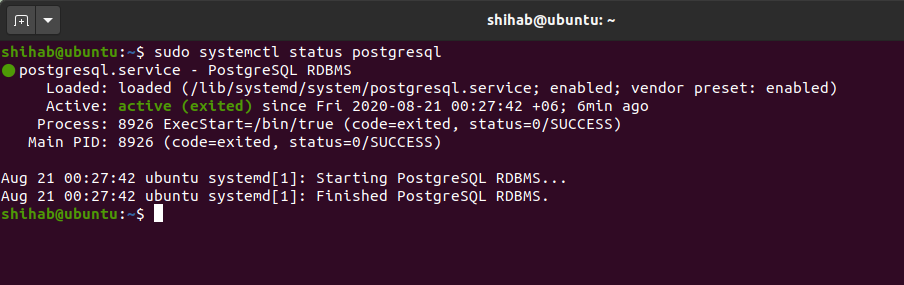

If the postgresql service is not active, to start it:

> $ sudo systemctl start postgresql

Now check again if it is active or not. 

If you want to stop the service(it is recommended to keep the service active/start to work with the database): 

>$ sudo systemctl stop postfresql

# Postgres Prompt 
The installation procedure created a user account called postgres that is associated with the default Postgres role. There are a few ways to utilize this account to access Postgres. One way is to switch over to the postgres account on your server by typing:

>$ sudo -iu postgres

It will lead you to:  postgres@ubuntu:~$ 

NOW, you can access the Postgres prompt by typing:
>$ psql

You have landed at the following SQL prompt − postgres=#

Another way to connect to the Postgres prompt is to run the __psql__ command as the postgres account directly with sudo:
>$ sudo -iu postgres psql 

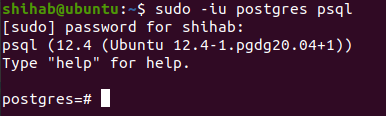

This will log you into the PostgreSQL prompt, and from here you are free to interact with the database management system right away.
You can type help to get help: 

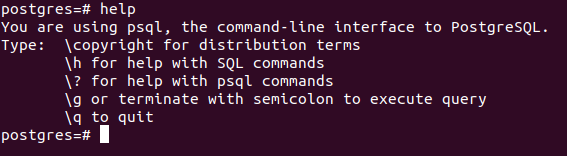

To exit out of the PostgreSQL prompt, run the following:
>postgres=#\q

This will bring you back to the postgres Linux command prompt(__postgres@ubuntu:~$__ ). To return to your regular system user, run the exit or CTRL+d command:

# SQL Commands
Let's learn some SQL COMMANDS. You can go to the official docs for commands which is   [OFFICIAL SQL COMMANDS](https://www.postgresql.org/docs/12/sql-commands.html)

## Create Database

Before creating a database let's see our List of databases. To see this just simply type __\l__, this will list out your databases and others information

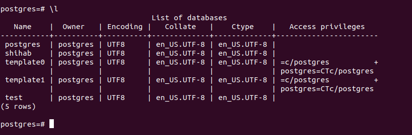

Here you can see I have 5 databases(I created shihab and test databases before writmg this docs)
Let's create a new database for this docs, let me name it testdb(you can name it whatever you want).

The __syntax__ is: 
                
                CREATE DATABASE dbname; 
                or create database dbname;

It is good to use the upper case letter for SQL Commands. 
Don't forget to put the semicolon(;) at the end. 

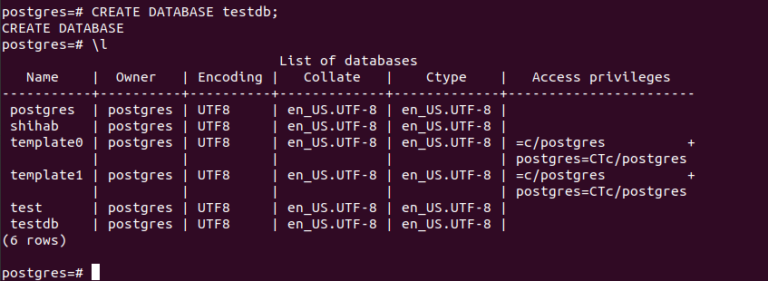

We just created a datbase __testdb__ .

## Drop Datbase
To drop a database simply execute:

                DROP DATABASE dbname; 

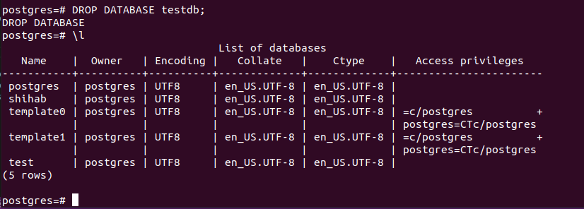

__BE CAREFUL__. Be extra careful to __drop a database/table__. Because you can not even undo this. Is is dangerous because you could have a 5/10y ears of data in a database, so if you run it, you will loose everything. __BE CAREFUL__

For our learning I have created the __testdb__ again.

## Connect to Our Datbase
We have crated a datbase name __testdb__ so far, let's connect to it( till now we are connected to postgres database).
There are two ways to connect to a database.
<ol>
1. Type following from your regular user mode

            psql -h localhost -p 5432 -U postgres testdb  
It will ask you the password of postgres; which is __postgres__ by default. In the above command -h option is for hostname(here it is localhost becuase we are connecting to a local database, if you want to connect to a remote database then put the ip address here), -p is the port number(default is 5432), -U is for username and then the database name that we want to connect.

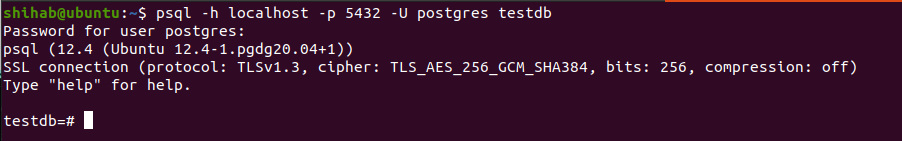
2. The other way, which is the simplest way is to execute the following command from __PostgreSQL prompt__

            \c dbname
Here, dbname = The Datbase you want to connect. In our case, it is testdb.

</ol>

As you can see, now we are connected to our __testdb__ database.

## Create Tables
Basic syntax of CREATE TABLE statement is as follows −

            CREATE TABLE table_name(
               column1 + datatype,+ constraints if any,
               column2 + datatype,+ constraints if any,
               .....
               columnN + datatype,+ constraints if any
            );
Check, the list of DataTypes available in Postgres [Clcik Here](https://www.postgresql.org/docs/12/datatype.html)

So why Table is important, for example, we want to save a new contact in our phone, which information do we need to save a new contact? We need a person firs_name, last_name, Phone_number, email, address etc. 
Now Let's create a new table __contacts__ with such information: 

            CREATE TABLE contacts (
               first_name VARCHAR(50) NOT NULL,
               last_name VARCHAR(50),
               phone_number VARCHAR(11) NOT NULL,
               email VARCHAR(100),
               address VARCHAR(100)
            );

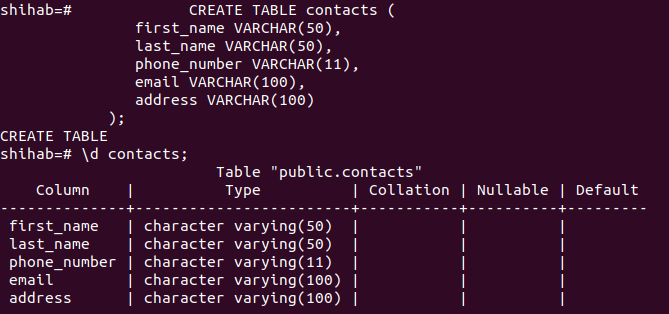

*i am sorry, NOT SO SORRY actually :p, I accidently created the table in my shihab database, it is not a problem, you may use __testdb__ . So from now onwards, I will execute everything on 'shihab' database(shihab is my nickname and I am too lazy to change it to testdb because I realize it aftrer writing the INSERT INTO RECORDS section)

Here, you can see, we have created a table named __contacts__ without any constraints whatsoever. Let us modify this table. So we can modify a table using __ALTER__ command, you will see it a bit later. For now, let me drop this table(BE CARFULL to DROP a table/anything) and create it again with a NOT NULL constraint.

We are using __NOT NULL__ with first_name and phone_number columns, it is because we don't want any NULL value for a person name and his/her number, other field can contain null value. You can use UNIQUE with first_name/phone_number column if you want to restrict the two persons cannot have same first_name/phone_number. For simplicity, I am ony using NOT NULL(I recommend you to play around with different constraints while practicing).

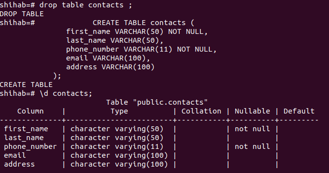

 If you don't understand the difference between a Non Zero, Zero, Null and unidentified values, please have look at the picture below, you will understand.

Let's create another table __person__ with some constraint: 

            CREATE TABLE person (
               id BIGSERIAL PRIMARY KEY,
               first_name VARCHAR(50) NOT NULL,
               last_name VARCHAR(50) NOT NULL,
               gender VARCHAR(7) NOT NULL,
               date_of_birth DATE NOT NULL,
               email VARCHAR(100) 
            );
<!--  nothing-->
## Constraints 
I want you to look [here](https://www.postgresql.org/docs/8.1/ddl-constraints.html)  if you want to know details about all the constraints. It is very important to know the differences.

 Primary Key: Uniquely identifies recordes, a primary key is both NOT NULL and UNIQUE, it means primary key column values can not have null value and every value is different. A table can have one and only primary key(it is applied on column or group of columns)

 UNIQUE Key: Unique constraints ensure that the data contained in a column or a group of columns is unique with respect to all the rows in the table. By default, it may contain null values. A table can have multiple/more than one Unique Keys.

## Insert Records 

Basic Syntax of INSERT into a table syntax is as follows: 

            INSERT INTO table_name(column1, column2, …)
            VALUES (value1, value2, …);

Let me insert some data into our person table:

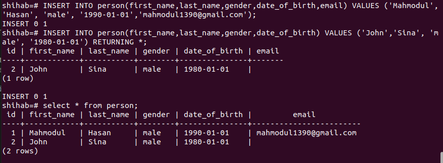

**NOTICE, I didn't mention the column name id when inserting records into person, but it is still showing id values, figure it out why??

RETURNING * is optional, use it if you want to return just some information of the inserted row. 
OR you can just read the data of table(using SELECT QUERY).

*** TRY to INSERT NULL values in the null column and see what happens.

### Insert record from another table

We can acctually insert records from another table to a table.

            INSERT INTO table1(column1, column2, …)
            SELECT column(s) FROM table2;

Remember, we created a table contacts??? Now let me insert some data into it from another table I created.

**Make sure to match the datatype of both tables. 

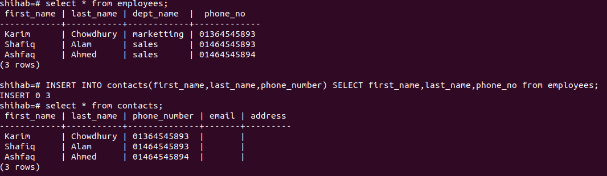

Now play arround it. Try to insert data from another table to a new table with mismatch datatype.

For our practice I am going to insert 100 more records into employees table, don't worry you don't need to execute INSERT command 100 times. You will get the sql file from my __sql folder__. Just copy it and run them into your terminal. Or you can execute the deownloaded file like following from your prompt : 

            \i [your file location];
            in my case this is as follows: 
            shihab=# \i /home/shihab/Documents/employees.sql;

You are good to go. Now, read(SELECT Query) the data of this table you will see 100 records in employees table

## SELECT FROM a table(READING data from table)

Alright, so far we have learned how to create a database, create a table and how to insert some records into it. Now, let's learn how to READ the data from a table. The syntax is as follows: 

            SELECT column1, column2, columnN FROM table_name;
            OR,
            SELECT * FROM table_name;

If you want to read the records of every column, use * , or if you want to read the data of specific column than mention the name of the column before FROM clasue. AS SIMPLE AS THAT.

Let's see an example : 

            SELECT * from employees;
            to see only first_name and date_of_birth
            SELECT first_name, date_of_birth FROM employees;

Now, let's say we don't want to see every records that is in our table. We just want to see top 5 records, to do that :

            SELECT column FROM table LIMIT N;
            OR,
            SELECT column FROM TABLE FIRST N ROWS ONLY;

HERE N = number of records you want to retrieve.

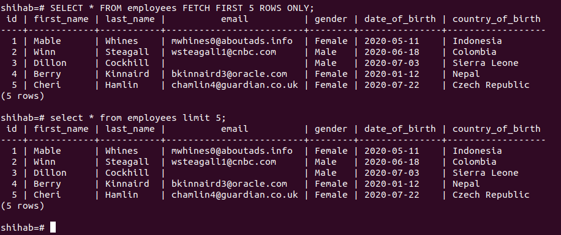

## WHERE clause

The WHERE clause appears right after the FROM clause of the SELECT statement.  The WHERE clause uses the condition to filter the rows returned from the SELECT clause.

The Syntax is : 

            SELECT select_list
            FROM table_name
            WHERE condition; 

Now, let's say we want to know the first_name of employees whose country_of_birth is United States: 

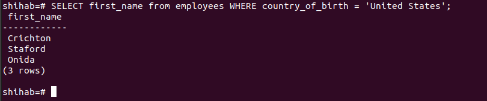

## ORDER BY (Sort our DATA)

Now, let's say we want to sort out our data. To do so, we have __ORDER BY__ clause. When you query data from a table, the SELECT statement returns rows in an unspecified order. To sort the rows of the result set, you use the ORDER BY clause in the SELECT statement.
The Syntax is : 

            SELECT column-list    
            FROM table_name    
            [WHERE condition]    
            [ORDER BY column1, column2, .. columnN] [ASC | DESC];    

For now , let's sort our employees table based on emplyees first_name ascending :

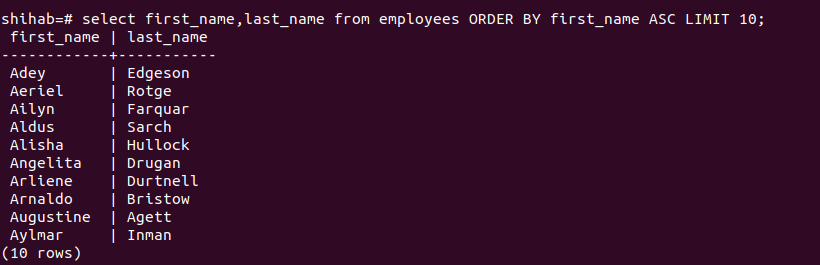

Since the ASC option is the default, you can omit it in the ORDER BY clause. You can omit LIMIT clause if you want retrive all records.

## DISTINCT

The DISTINCT clause is used in the SELECT statement to remove duplicate rows from a result set. The DISTINCT clause keeps one row for each group of duplicates. The DISTINCT clause can be applied to one or more columns in the select list of the SELECT statement.

         SELECT
         DISTINCT column(s)
         FROM
         table_name; 

